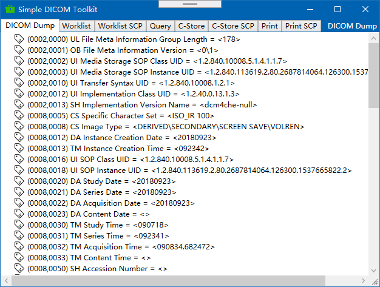
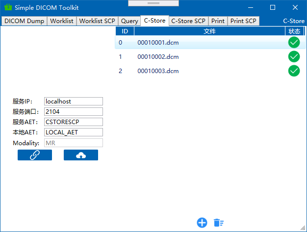

# DICOM Toolkit

*A Simple DICOM Toolkit*

## 截图

## 功能

- Simple Dicom Dump [**慎用修改和保存功能**]

- Worklist SCU/SCP with MPPS [测试功能]

- Query Retrieve SCU [测试功能]

- C-Store SCU/SCP

- Print SCU/SCP

## dependency packages

- [fo-dicom](https://github.com/fo-dicom/fo-dicom)

- [NLog](https://nlog-project.org/)

- [Stylet](https://github.com/canton7/Stylet)

- [Nett](https://github.com/paiden/Nett)

- [MQTTnet](https://github.com/chkr1011/MQTTnet)

- [ookii-dialogs-wpf](https://github.com/augustoproiete/ookii-dialogs-wpf)

- [Microsoft.Xaml.Behaviors](https://github.com/Microsoft/XamlBehaviorsWpf)

**部分图标来源于[阿里巴巴矢量图标库](https://www.iconfont.cn/)**

**其它常用软件**

- [DICOM Dump](http://www.makhaon.com/index.php?lng=en&p=products&id=dicomdump)

- [Print SCP](http://www.charruasoft.com/products/printscp/)

- [ClearCanvas](https://www.clearcanvas.ca/)

- [jDicom](http://members.chello.at/petra.kirchdorfer/jdicom/)

- [ITK-SNAP](http://www.itksnap.org/pmwiki/pmwiki.php)

- [Medical Connections](https://www.dicomserver.co.uk/)
