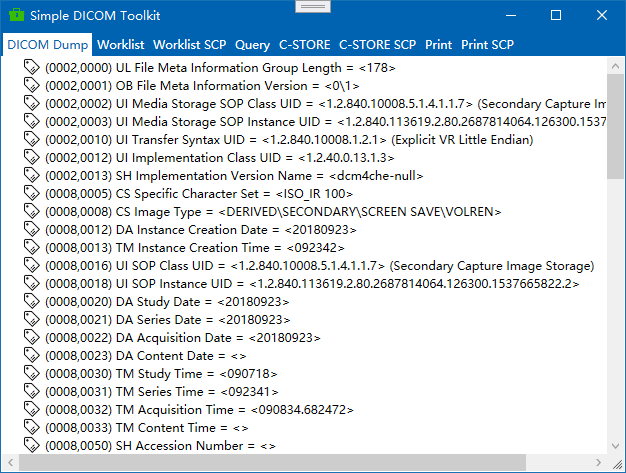
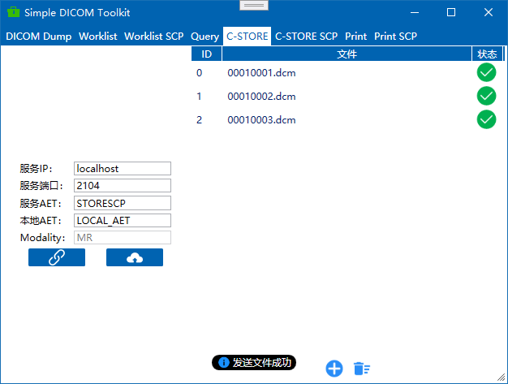

# DICOM Toolkit

*A Simple DICOM Toolkit*

## 截图

## 功能

*以下功能仅供测试/调试使用*

- Simple DICOM Dump [**慎用修改和保存功能**]
- Worklist SCU/SCP with MPPS
- Query Retrieve SCU/C-MOVE SCU
- C-STORE SCU/SCP
- Print SCU/SCP

## dependency packages

- [fo-dicom](https://github.com/fo-dicom/fo-dicom)
- [NLog](https://nlog-project.org/)
- [Stylet](https://github.com/canton7/Stylet)
- [LiteDB](http://www.litedb.org/)
- [FluentValidation](https://fluentvalidation.net/)
- [Polly](http://www.thepollyproject.org/)
- [Nett](https://github.com/paiden/Nett)
- [MQTTnet](https://github.com/chkr1011/MQTTnet)
- [ookii-dialogs-wpf](https://github.com/augustoproiete/ookii-dialogs-wpf)
- [Microsoft.Xaml.Behaviors](https://github.com/Microsoft/XamlBehaviorsWpf)

**部分图标来源于[阿里巴巴矢量图标库](https://www.iconfont.cn/)**

**其它常用软件**

- [DICOM Dump](http://www.makhaon.com/index.php?lng=en&p=products&id=dicomdump)
- [Print SCP](http://www.charruasoft.com/products/printscp/)
- [ClearCanvas](https://www.clearcanvas.ca/)
- [jDicom](http://members.chello.at/petra.kirchdorfer/jdicom/)
- [ITK-SNAP](http://www.itksnap.org/pmwiki/pmwiki.php)
- [Medical Connections](https://www.dicomserver.co.uk/)

## License
